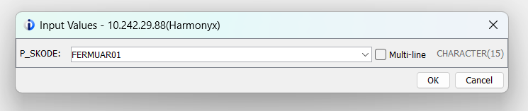
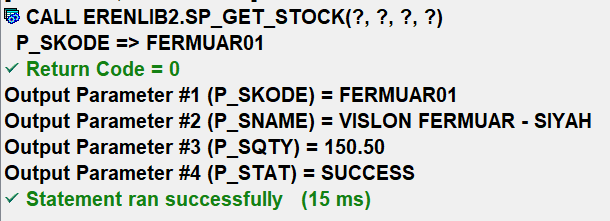

# GETSTKR-IBM-i-RPGLE-SQL-Stored-Procedure-Integration
Stock Inquiry Service - Stok Sorgulama Servisi

Bu proje, IBM i (AS/400) üzerinde koşan geleneksel RPGLE programlarını modern mimarilere (Web, Mobil, BI araçları) bağlamak için oluşturulmuş bir "Backend Veri Servisi" örneğidir.
Genellikle "Legacy" olarak adlandırılan sistemlerdeki veriyi, bir Web Geliştiricinin (Node.js, PHP, Python, C# vb.) kolayca çağırabileceği bir SQL Stored Procedure yapısına dönüştürür. Bu yöntem, karmaşık IWS (Integrated Web Services) kurulumlarına gerek kalmadan, veritabanı seviyesinde hızlı ve güvenli bir API altyapısı sağlar.

Teknik Bileşenler:

    1- Veritabanı (Physical File - PF): Stok verilerinin (Kodu, Adı, Miktarı) fiziksel olarak saklandığı STOKP dosyası.
    2- İş Mantığı (RPGLE): Dışarıdan parametre alan, veritabanında CHAIN (indeksli arama) işlemi yapan ve sonuçları geri döndüren GETSTKR programı.
    3- Servis Katmanı (SQL Procedure): RPGLE programını dış dünyaya bir fonksiyon gibi sunan SP_GET_STOCK prosedürü.

Nasıl Çalışır?

    * Web uygulaması, DB2 veritabanına bir SQL bağlantısı açar.
    * CALL ERENLIB2.SP_GET_STOCK(?, ?, ?, ?) komutunu çalıştırır.
    * IBM i işletim sistemi arka planda RPGLE programını tetikler.
    * RPGLE, stok bilgilerini bulur ve parametreler üzerinden web uygulamasına JSON-hazır formatta geri gönderir.

------------------------------------------------------------------------------

Project Overview: Stock Inquiry Service

This project demonstrates a "Backend Data Service" designed to bridge traditional RPGLE programs on IBM i (AS/400) with modern architectures such as Web, Mobile, and BI tools.
It transforms data logic within legacy systems into a SQL Stored Procedure that any Web Developer (Node.js, PHP, Python, etc.) can easily invoke. This approach provides a fast and secure API infrastructure at the database level without the need for complex IWS (Integrated Web Services) configurations.

Technical Components:

    1- Database (Physical File - PF): The STOKP file where stock data (Code, Name, Quantity) is physically stored.
    2- Business Logic (RPGLE): The GETSTKR program, which accepts parameters, performs a CHAIN (indexed search) on the database, and returns the results.
    3- Service Layer (SQL Procedure): The SP_GET_STOCK procedure, which exposes the RPGLE program to the outside world as a callable function.

How It Works ?

    * The web application opens a SQL connection to the DB2 database.
    * It executes the command CALL ERENLIB2.SP_GET_STOCK(?, ?, ?, ?).
    * The IBM i operating system triggers the RPGLE program in the background.
    * The RPGLE fetches the stock information and returns it to the web application via parameters in a JSON-ready format.

